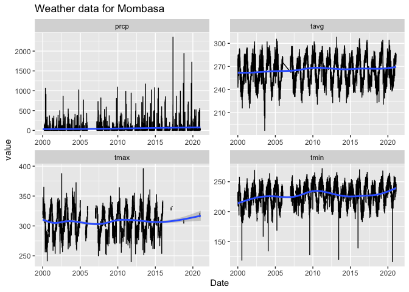

<!-- README.md is generated from README.Rmd. Please edit that file -->

# kenyaweather

<!-- badges: start -->

[](https://www.tidyverse.org/lifecycle/#experimental)
[](https://CRAN.R-project.org/package=kenyaweather)
[](https://github.com/merely-useful/kenyaweather/actions)
<!-- badges: end -->

The goal of kenyaweather is to …

## Installation

You can install the released version of kenyaweather from
[CRAN](https://CRAN.R-project.org) with:

``` r
remotes::install_github("merely-useful/kenyaweather")
```

## Example

This is a basic example which shows you how to solve a common problem:

``` r
library(kenyaweather)

weather_report("Mombasa")
#> `geom_smooth()` using method = 'gam' and formula 'y ~ s(x, bs = "cs")'
```



``` r
weather_summary("Lodwar")
```

| variable                        | precipitation | average\_temp |   max\_temp |    min\_tmp |
|:--------------------------------|--------------:|--------------:|------------:|------------:|
| Maximum Year                    |    2021.00000 |   2009.000000 | 2021.000000 | 2016.000000 |
| Minimum Year                    |    2003.00000 |   2012.000000 | 2020.000000 | 2021.000000 |
| Average across Years            |      81.10627 |    301.285028 |  238.887486 |  358.295071 |
| Standard Deviation across Years |     184.39357 |      6.079021 |    6.367616 |    4.502842 |

## Repository Structure

-   `R/` contains the package functions.

-   `dev-scripts/` contains a script to re-generate this
    repository. &gt; Don’t run unless you want to overwrite things in
    the repo.

-   `tests/` contains the tests.

-   `.github/` is where both the community files such as
    `CONTRIBUTING.md` and the GitHub Actions live.
